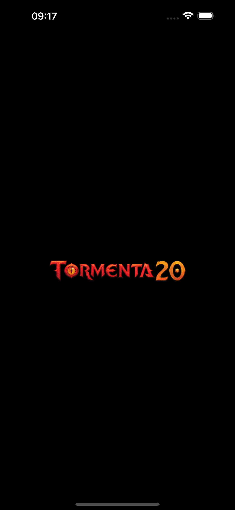
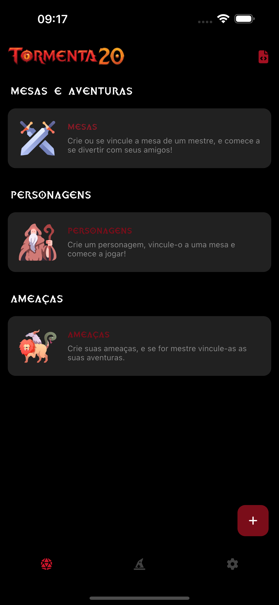
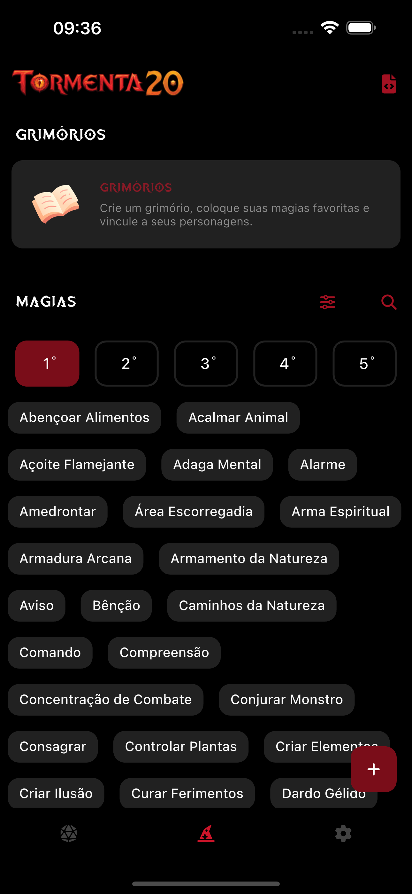
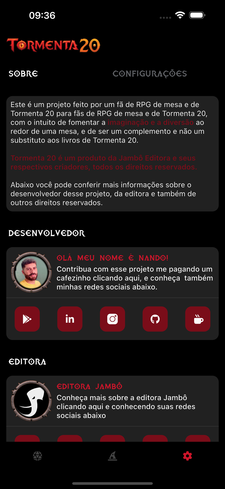

## Tormenta20 - Criação de ficha, gerenciameno de mesas e aventuras

Este é um projeto feito por um fã de RPG's de mesa e de Tormenta 20 para fãs de RPG's de mesa e de Tormenta 20, com o intuito de fomentar a  ao redor de uma mesa, e de ser um complemento e não um substituto aos livros de Tormenta 20.

Tormenta 20 pertence a Jambo Editora, Todos os direitos sobre a marca Tormenta 20 são reservados a editora.

## ⚠️ Avisos

Este projeto ainda está em desenvolvimento, foram realizados testes práticos em dispositivos reais e em emuladores, posteriormente serão adicionados testes unitários, mais telas, compontente e funções.

## ⚙️ Questões técnicas de design patterns utilizados

✅ Este projeto está sendo desenvolvido com o Flutter SDK 3.24.3 e (Flutter)Dart SDK 3.5.3.

Para este projeto está sendo utilizado separação de pastas modular, sendo os principais: core/modules/shared.
No core está contido tudo que é utilizado na main do projeto ou instâncias que estão no cerne do projeto como o local dataBase.
No modules, estão todos os modulos do projetos que representam cada tela.
No Shared está todas as classes e instâncias que são compartilhadas no projeto como por exemplo: widgets, utils e extensões.

Este é um projeto offline first, e não se conecta a nenhum database externo, para o localStorage esta sendo utiliza da biblica Drift, que tem modelo de escrita tabelar.

Para a reatividade do projeto está sendo utilizado ValueNotifier e o ChangeNotifier, que são do próprio Flutter, e em modelo de stores ricas.

Para a navegação, está sendo utilizada a navegação padrão do Flutter, sem ser nomeada.

## 🎨 Regras e princípios de UX/UI

Cor de acentuação e destaque no projeto: #CC152A, por se a cor predominante no RPG de tormenta2.
Para a distrubuição de cores está sendo utilizada o princípio 60/30/10, que distribui que aproximadamente, 60% da tela terá a cor de fundo, 30% a cor do texto, e 10% a cor de acentuação do projeto.
O projeto foi feito em tema escuro, e para demonstrar elevação foi utilizada uma sequência de cores do Material Design
Para as areás de toques foram respeitadas as dimensões apontadas pela Cupertino (ios) e Material (android) e a aréa minima de toque do projeto é de 48 pixels.
Para as margens de tela e entre componente, varia entre 2 a 32 pixel a depender do contexto, para o tamanho dos componentes foi utilizada grade de 8 para manter um design mais coeso independente do tamanho das telas dos dispositivos.
Para a navegação não foram utilizados os padrões de backbutton do Material ou Cupertino, afim de criar uma identidade própria e maior imersão ao projeto
As fontes utilizadas no projeto foram: tormenta, medieva.

### 💡 Futuramente novas informações e modificações serão adicionadas a esse Readme

